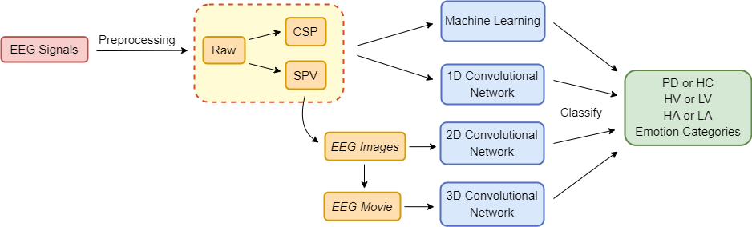

Exploring EEG-based Affective Analysis \& Detection of Parkinson's Disease
=================================

This is the official GitHub repository for the paper "Exploring EEG-based Affective Analysis \& Detection of Parkinson's Disease".

Pre-print version of the paper: [https://arxiv.org/abs/2202.12936](https://arxiv.org/abs/2202.12936)

---------------------------------
## Abstract
While Parkinson's disease (PD) is typically characterised by motor disorder, there is also evidence of diminished emotion perception in PD patients. This study examines the utility of Electroencephalography (EEG) signals to understand emotional differences between PD and Healthy Controls (HC), and for automated PD detection. Employing traditional machine learning and deep learning methods on multiple EEG descriptors, we explore (a) dimensional and categorical emotion recognition, and (b) PD vs HC classification from multiple descriptors characterising emotional EEG signals. Our results reveal that PD patients comprehend arousal better than valence and, amongst emotion categories, _fear_, _disgust_ and _surprise_ less accurately, whereas _sad_ most accurately. Mislabelling analyses confirm confounds among opposite-valence emotions for PD data. Emotional EEG responses also achieve near-perfect PD vs HC recognition.
Cumulatively, our study demonstrates that (a) examining _implicit_ responses alone enables (i) discovery of valence-related impairments in PD patients, and (ii) differentiation of PD from HC, and (b) emotional EEG analysis is an ecologically-valid, effective, facile and sustainable tool for PD diagnosis vis-\'a-vis self reports, expert assessments and resting-state analysis.

--------------------------------
## Overview

Our pipeline involves (a) EEG pre-processing and extraction of features such as Spectral Power Vectors (SPV)
and Common Spatial Patterns (CSP), (b) feeding of these features or derived representations such as EEG images
and movies to machine and deep learning frameworks to perform (i) dimensional and discrete emotion recognition,
and (ii) PD vs HC classification.

--------------------------------
## Project Organisation

    ├── README.md
    │
    ├── matlab_files
    │   ├── README.md
    │   ├── eeg_csp_raw.m       <- Matlab function file to extract 'Raw' and Common Spatial Patterns (CSP) features
    │   ├── eeg_csp_raw_run.m   <- Matlab 'main' file to run eeg_csp_raw.m
    │
    ├── eeg_spectral.ipynb      <- Jupyter notebook for extracting Spatial Power Vectors (SPV) from 'Raw'.
    │
    ├── eeg_to_images.ipynb     <- Jupyter notebook for converting SPVs to 'EEG Images' and 'EEG Videos'.
    │
    ├── EEG_ML.ipynb            <- Jupyter notebook for classification tasks using various ML algorithms.
    │
    ├── EEG_1D_CNN.ipynb        <- Jupyter notebook for classification tasks using various 1D-CNN.
    │
    ├── EEG_2D_CNN.ipynb        <- Jupyter notebook for classification tasks using various 2D-CNN.
    │
    ├── EEG_3D_CNN.ipynb        <- Jupyter notebook for classification tasks using various 3D-CNN.
    │
    ├── Stat_test.ipynb         <- Jupyter notebook for performing various statistical tests on the results obtained.

--------------------------------
## Acknowledgment
This research was supported partially by the Australian Government through the Australian Research Council's Discovery
Project funding scheme.

-------------------------------
